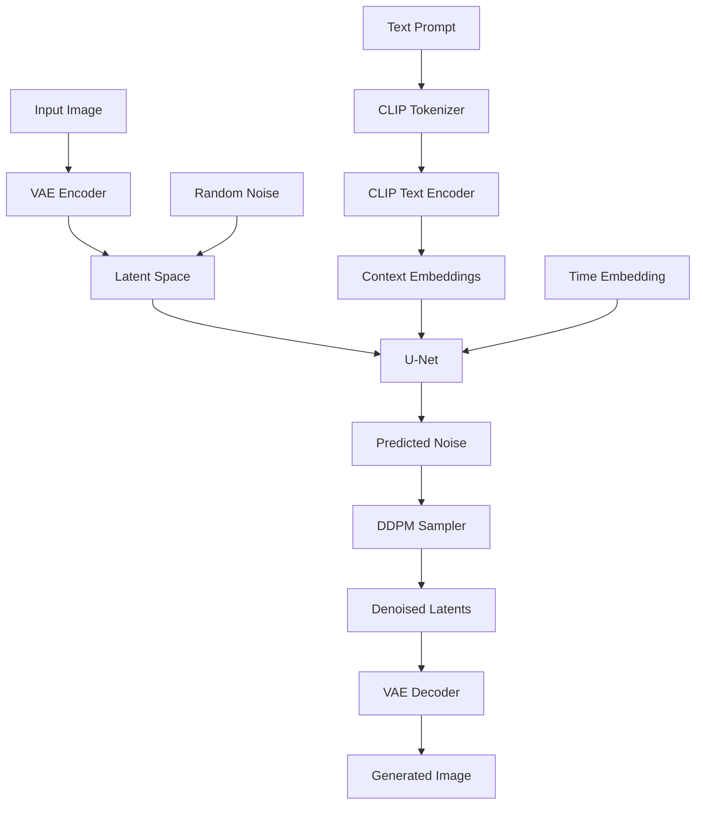

# 🎨 Stable Diffusion from Scratch

A complete implementation of Stable Diffusion v1.5 built from scratch using PyTorch. This repository provides a clean, educational codebase for understanding the inner workings of diffusion models for image generation.


## 📖 Overview

Stable Diffusion is a latent text-to-image diffusion model capable of generating photorealistic images from text prompts. This implementation covers all core components:

- **VAE (Variational Autoencoder)** - Encoder and Decoder for latent space compression
- **CLIP Text Encoder** - Text conditioning with 12-layer transformer
- **U-Net** - Noise prediction network with attention mechanisms
- **DDPM Sampler** - Denoising Diffusion Probabilistic Model sampling

## 🏗️ Architecture



## 📁 Project Structure

```
StableDiffusion/
├── sd/
│   ├── attention.py      # Self-Attention & Cross-Attention mechanisms
│   ├── clip.py           # CLIP text encoder implementation
│   ├── ddpm.py           # DDPM noise scheduler and sampler
│   ├── decoder.py        # VAE Decoder with residual & attention blocks
│   ├── diffusion.py      # Main diffusion model combining U-Net + time embedding
│   ├── encoder.py        # VAE Encoder for image-to-latent compression
│   ├── pipeline.py       # End-to-end generation pipeline
│   └── unet.py           # U-Net architecture with attention blocks
├── data/
│   ├── vocab.json        # CLIP tokenizer vocabulary
│   ├── merges.txt        # BPE merge rules
│   └── v1-5-pruned-emaonly.ckpt  # Model weights (not tracked)
├── images/
│   └── ...               # Output images directory
└── README.md
```

## 🧩 Components

### 1. CLIP Text Encoder (`clip.py`)
Implements the text conditioning model using a 12-layer transformer with:
- Token + Position Embeddings (vocab: 49408, embed: 768, tokens: 77)
- Self-Attention with causal masking
- QuickGELU activation function

### 2. VAE Encoder/Decoder (`encoder.py`, `decoder.py`)
Variational Autoencoder for latent space operations:
- **Encoder**: Compresses 512×512 RGB images to 64×64×4 latent tensors
- **Decoder**: Reconstructs images from latent representations
- Uses GroupNorm, SiLU activations, and residual connections

### 3. U-Net (`unet.py`)
The noise prediction network featuring:
- Encoder-Decoder architecture with skip connections
- Residual blocks with time embedding conditioning
- Self-Attention and Cross-Attention blocks
- Channel progression: 320 → 640 → 1280 → 1280

### 4. Attention Mechanisms (`attention.py`)
- **Self-Attention**: For spatial feature relationships
- **Cross-Attention**: For text-image conditioning (latent ↔ context)

### 5. Diffusion Model (`diffusion.py`)
Combines:
- Time embeddings (sinusoidal position encoding → 320 → 1280)
- U-Net for noise prediction
- Output projection layer

### 6. Pipeline (`pipeline.py`)
End-to-end generation with:
- Text-to-Image generation
- Image-to-Image transformation
- Classifier-Free Guidance (CFG) support
- Configurable inference steps and strength

## 🚀 Usage

### Prerequisites

```bash
pip install torch numpy tqdm transformers
```

### Download Model Weights

Download the Stable Diffusion v1.5 checkpoint and place it in the `data/` directory:
- Model: `v1-5-pruned-emaonly.ckpt` (~4GB)

### Text-to-Image Generation

```python
from sd.pipeline import generate
from transformers import CLIPTokenizer

# Load tokenizer
tokenizer = CLIPTokenizer.from_pretrained("openai/clip-vit-large-patch14")

# Load your models (encoder, decoder, clip, diffusion)
models = {
    "clip": clip_model,
    "encoder": encoder_model,
    "decoder": decoder_model,
    "diffusion": diffusion_model
}

# Generate image
image = generate(
    prompt="A beautiful sunset over mountains, digital art",
    uncond_prompt="",  # negative prompt
    do_cfg=True,
    cfg_scale=7.5,
    sampler_name="ddpm",
    n_inference_steps=50,
    models=models,
    seed=42,
    device="cuda",
    tokenizer=tokenizer
)
```

### Image-to-Image Generation

```python
from PIL import Image

input_image = Image.open("input.jpg")

image = generate(
    prompt="A fantasy landscape painting",
    uncond_prompt="blurry, low quality",
    input_image=input_image,
    strength=0.8,  # Higher = more creative, Lower = closer to input
    do_cfg=True,
    cfg_scale=7.5,
    n_inference_steps=50,
    models=models,
    seed=42,
    device="cuda",
    tokenizer=tokenizer
)
```

## ⚙️ Key Parameters

| Parameter | Description | Default |
|-----------|-------------|---------|
| `strength` | How much to transform input image (0-1) | 0.8 |
| `cfg_scale` | Classifier-Free Guidance scale | 7.5 |
| `n_inference_steps` | Number of denoising steps | 50 |
| `seed` | Random seed for reproducibility | None |

## 📊 Technical Specifications

- **Input Resolution**: 512 × 512
- **Latent Dimensions**: 64 × 64 × 4
- **Text Sequence Length**: 77 tokens
- **Text Embedding Dimension**: 768
- **U-Net Channels**: [320, 640, 1280, 1280]
- **Attention Heads**: 8 (with varying head dimensions)

## 🔬 How It Works

1. **Text Encoding**: The prompt is tokenized and passed through CLIP to get text embeddings (77 × 768)

2. **Latent Initialization**: 
   - For text-to-image: Random noise in latent space
   - For image-to-image: Encode input image and add noise

3. **Iterative Denoising**: The U-Net predicts noise at each timestep, guided by text embeddings

4. **CFG Application**: Combine conditional and unconditional predictions for better adherence to prompts

5. **Decoding**: VAE decoder reconstructs the final image from denoised latents

## 📚 References

### Research Papers

| Paper | Authors | Link |
|-------|---------|------|
| **High-Resolution Image Synthesis with Latent Diffusion Models** (Stable Diffusion) | Rombach et al., 2022 | [arXiv:2112.10752](https://arxiv.org/abs/2112.10752) |
| **Denoising Diffusion Probabilistic Models** (DDPM) | Ho et al., 2020 | [arXiv:2006.11239](https://arxiv.org/abs/2006.11239) |
| **Learning Transferable Visual Models From Natural Language Supervision** (CLIP) | Radford et al., 2021 | [arXiv:2103.00020](https://arxiv.org/abs/2103.00020) |

### Libraries & Resources

- 🤗 **[Hugging Face Diffusers](https://huggingface.co/docs/diffusers)** - State-of-the-art diffusion models library
- 🔥 **[PyTorch](https://pytorch.org/)** - Deep learning framework
- 📦 **[CompVis/stable-diffusion](https://github.com/CompVis/stable-diffusion)** - Original Stable Diffusion repository
- 🧠 **[OpenAI CLIP](https://github.com/openai/CLIP)** - Contrastive Language-Image Pre-training

## 📝 License

This project is for educational purposes. Please refer to the original Stable Diffusion license for commercial use.

---

<div align="center">

### 🌌 Built with ❤️ by **Sabari Srinivas** with **Antigravity**

*Pushing the boundaries of AI-powered image generation*


</div>
